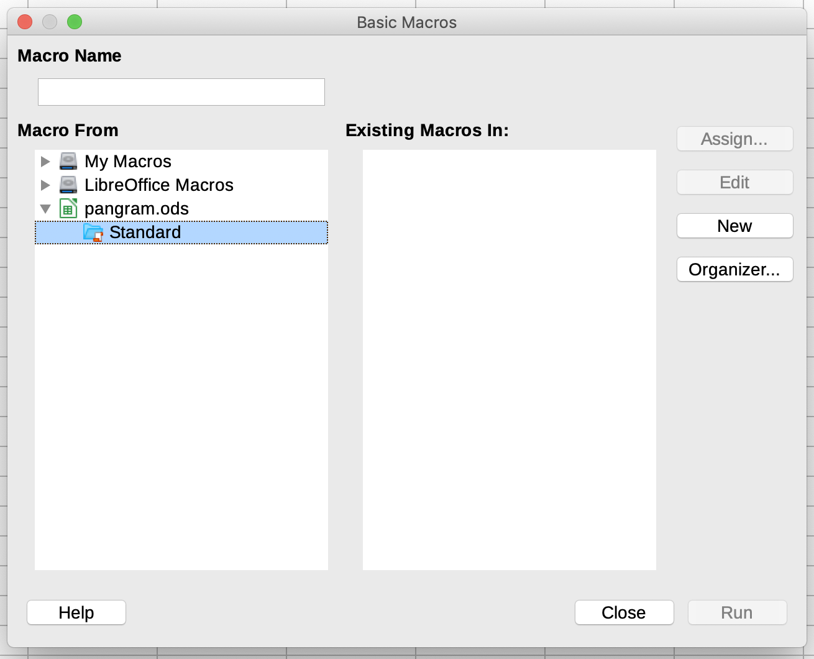
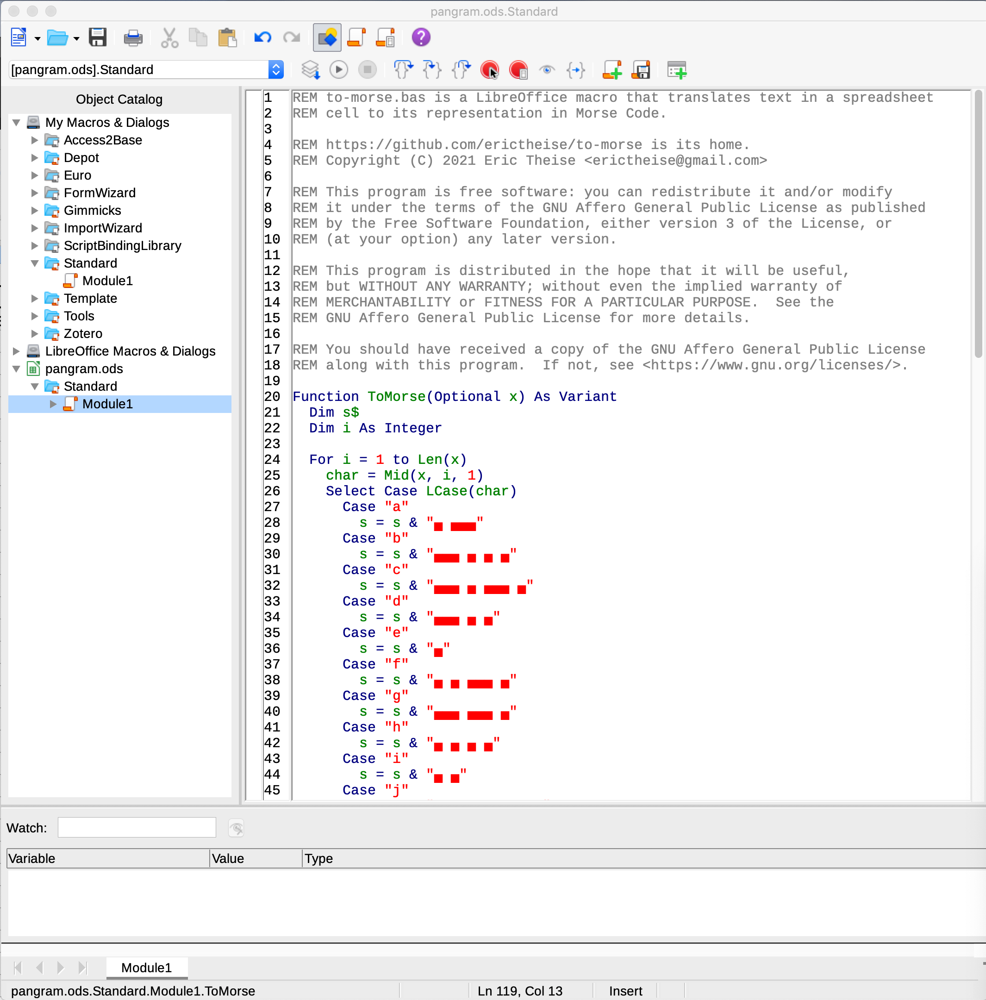
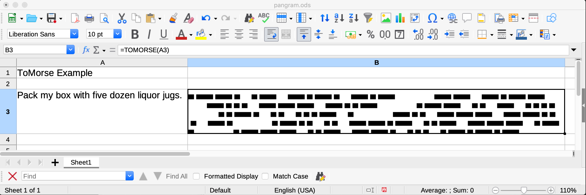

# to-morse

`to-morse.bas` is a [LibreOffice](https://www.libreoffice.org/) macro that translates text in a spreadsheet cell to its representation in Morse Code.

## Quick start

To add `to-morse.bas` to the `pangram.ods` LibreOffice spreadsheet included in this repository I followed these steps:

  1. Tools → Macros → Organize Macros → Basic…

  

  2. New → Module1

  

  3. OK. Paste the [raw contents of to-morse.bas](https://raw.githubusercontent.com/erictheise/to-morse/main/to-morse.bas) over the program skeleton in the IDE.

  

  4. Save & close
  5. Add `=ToMorse()` to the spreadsheet

You may find that you need to `Enable Macros` depending on your security settings.

## Why `to-morse`?

I'd normally program something like this in Python, JavaScript, or Ruby but I was working on dialogue for a moving image project and a spreadsheet seemed like the most natural tool at my disposal for generating drafts. Rather than uploading contents cell-by-cell into an online Morse Code converter this function seemed like the best way to go.

I haven't coded in any variant of BASIC for decades.

I did have a Novice class amateur radio license in my youth, and I've retained some of that in brain and in muscle memory, but I've found that having a _dit-dah_ script is a good fallback.

## Compatibility with other spreadsheet programs

Unknown. LibreOffice derives from OpenOffice so I'd expect it to work there. I don't have access to a copy of Excel. Google Sheets seems not to import the macro along with `pangram.ods`. Numbers does not open `.ods` files directly at all.

I welcome pull requests that insert succinct descriptions of using this macro with spreadsheet software other than LibreOffice. Thanks in advance!

## Gotchas and to-dos

Due to time limitations, not all punctuation marks are translated. I welcome pull requests to add ones I've missed. __Please note__ that non-breaking spaces are used within the Morse Code representations and to bracket spacing; I strongly encourage you to use an IDE that explicitly identifies whitespace characters. (I used WebStorm, one of JetBrains' offerings but it's a common option within IDEs.)

It'd be handy if the macro could programmatically recognize certain [_prosigns_](https://en.wikipedia.org/wiki/Prosigns_for_Morse_code) that use an overline text decoration, and subsequently compress multiple codes into a single one. [I'm not clear if LibreOffice has that capability](https://ask.libreoffice.org/en/question/302360/how-can-i-identify-decorated-text-eg-overlining-using-a-macro/).

It'd be nice to be smarter about spacing when cell content wraps, i.e., it'd be great if the Morse Code cell looked left-justified.
