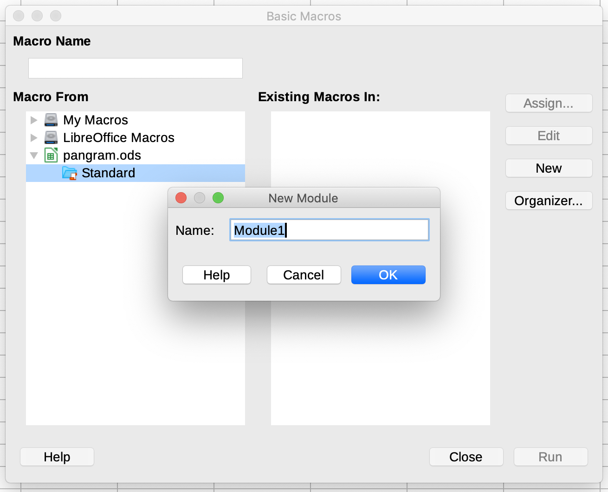

# to-morse

`to-morse.bas` is a LibreOffice macro that translates text in a spreadsheet cell to its representation in Morse Code.

## Quick Start

To add `to-morse.bas` to the `pangram.ods` LibreOffice spreadsheet included in this repository I followed these steps:

  1. Tools → Macros → Organize Macros → Basic…

  

  2. New → Module1

  

  3. OK. Paste the [raw contents of to-morse.bas](https://raw.githubusercontent.com/erictheise/to-morse/main/to-morse.bas) over the program skeleton in the IDE.

  

  4. Save & close
  5. Add `=ToMorse()` to the spreadsheet

You may find that you need to `Enable Macros` depending on your security settings.

## Why `to-morse`?

I normally program in Python, JavaScript, or Ruby but I was working on dialogue for a moving image project and a spreadsheet seemed like the most natural tool at my disposal for generating drafts. Rather than uploading contents cell by cell into an online Morse Code converter this function seemed like the best way to go.

I haven't coded in any variant of BASIC for decades.

I did have a Novice class amateur radio license in my youth, and I've retained some of that in brain and in muscle memory, but I've found that having a _dit-dah_ script is a good fallback.

## Compatibility with other spreadsheet programs

Unknown. LibreOffice derives from OpenOffice so I'd expect it to work there. I don't have a copy of Excel. Google Sheets does not import the macro along with the spreadsheet. Numbers does not open `.ods` files directly.

Please feel free to create a pull request if you're willing to document using this with an alternate spreadsheet. Thanks!

## To do

It'd be handy if the macro could programmatically recognize a _Prosign_ by its overline and compress the multiple codes into one but [I'm not clear if LibreOffice has that capability](https://ask.libreoffice.org/en/question/302360/how-can-i-identify-decorated-text-eg-overlining-using-a-macro/).
